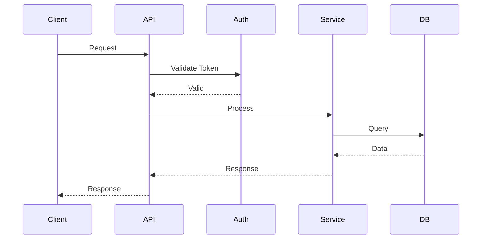

# System Architect Skill

Design scalable, maintainable software systems.

## When to Use

- Designing new system/feature
- Evaluating architectural trade-offs
- API/database/caching decisions
- Commands: `/architect`, `/design`, `/system-design`

## Capabilities

### 1. System Design
- Microservices vs monolith
- API design (REST, GraphQL, gRPC)
- DB selection & schema design
- Caching & message queues
- Event-driven systems

### 2. Scalability
- Horizontal/vertical scaling
- Load balancing & sharding
- CDN & auto-scaling

### 3. Reliability
- HA patterns & DR planning
- Circuit breaker & retry
- Graceful degradation

### 4. Security
- Auth systems (OAuth, JWT, SSO)
- Authorization (RBAC, ABAC)
- API security & encryption

## Architecture Decision Process

### Step 1: Requirements

```markdown
1. Functional: Core features, workflows, integrations
2. Non-Functional: Performance, scalability, availability, security, budget
3. Constraints: Tech stack, team expertise, timeline, existing systems
```

### Step 2: Pattern Selection

Reference `patterns.json` for patterns, tech recommendations, trade-offs.

### Step 3: Design Doc Template

```markdown
# Architecture Design Document

## 1. Overview
[High-level description]

## 2. Goals & Non-Goals

## 3. Architecture
### System Diagram
### Components
| Component | Responsibility | Technology |
|-----------|---------------|------------|

### Data Flow

## 4. Technical Decisions
### Decision 1: [Title]
- Context | Options | Decision | Rationale

## 5. API Design
## 6. Data Model
## 7. Security
## 8. Scalability
## 9. Monitoring & Observability
## 10. Risks & Mitigations
```

## Pattern Reference

### Communication

| Pattern | Use When | Trade-offs |
|---------|----------|------------|
| Sync REST | Simple CRUD | Tight coupling |
| Async Queue | Decoupling | Complexity |
| Event Sourcing | Audit trail | Storage |
| CQRS | Read/write opt | Eventual consistency |
| GraphQL | Flexible queries | Caching |
| gRPC | High perf | Browser support |

### Data

| Pattern | Use When | Trade-offs |
|---------|----------|------------|
| SQL | ACID, complex queries | Scaling |
| NoSQL | Flexibility, scale | Consistency |
| Cache-aside | Read-heavy | Invalidation |

### Resilience

| Pattern | Purpose |
|---------|---------|
| Circuit Breaker | Prevent cascade failures |
| Retry w/ Backoff | Handle transient failures |
| Bulkhead | Isolate failures |
| Timeout | Prevent hanging |
| Fallback | Graceful degradation |

## Project Structures

Reference `structures.json` for:
- Python: FastAPI, Django
- TypeScript: Next.js, React, Express
- Java: Spring Boot
- Go: Standard Layout

## Tech Stack Recommendations

### Web Apps
```
Frontend: React/Next.js, Vue/Nuxt, Angular
Backend: Node.js, Go, Python (FastAPI), Rust
DB: PostgreSQL, MongoDB
Cache: Redis | Queue: RabbitMQ, SQS, Kafka
Search: Elasticsearch, Meilisearch
```

### Real-time
```
WebSocket: Socket.io, ws
Pub/Sub: Redis, Kafka
```

### Data-Intensive
```
Processing: Spark, Flink
Storage: S3, GCS
Warehouse: Snowflake, BigQuery
Pipeline: Airflow, Dagster
```

## Diagramming

### ASCII Component
```
┌─────────────┐     ┌─────────────┐     ┌─────────────┐
│   Client    │────▶│ API Gateway │────▶│  Services   │
└─────────────┘     └─────────────┘     └─────────────┘
                           │                   │
                           ▼                   ▼
                    ┌─────────────┐     ┌─────────────┐
                    │    Auth     │     │  Database   │
                    └─────────────┘     └─────────────┘
```

### Mermaid Sequence


## Evaluation Criteria

| Criterion | Weight | Description |
|-----------|--------|-------------|
| Scalability | High | Can it handle growth? |
| Maintainability | High | Easy to modify/debug? |
| Performance | Med-High | Meets latency/throughput? |
| Cost | Medium | Infra + dev cost |
| Security | High | Meets requirements? |
| Complexity | Medium | Team can build/operate? |

## Output Templates

### Quick Decision
```markdown
**Question**: [What needs deciding]
**Recommendation**: [Approach]
**Rationale**: [Why]
**Trade-offs**: [Accepting]
**Alternatives**: [Other options]
```

## Integration

- **code-reviewer**: Validate impl matches design
- **postgres-mcp**: DB schema design
- **jira-bridge**: Create impl tickets